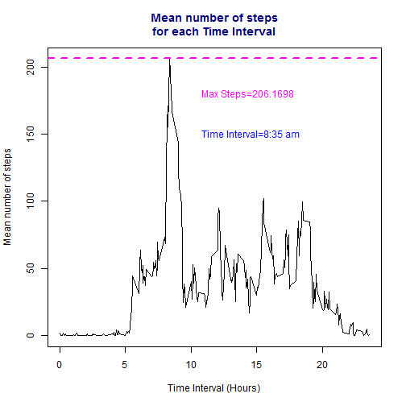
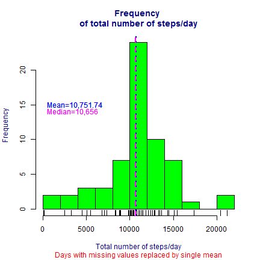
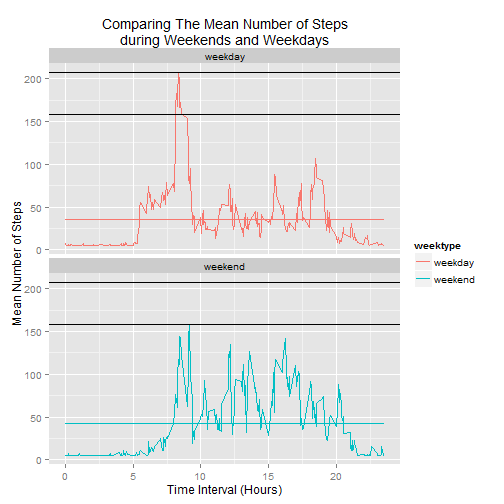

## Introduction
This course focuses on the concepts and tools behind reporting modern data analyses in a reproducible manner. Reproducible research is the idea that data analyses, and more generally, scientific claims, are published with their data and software code so that others may verify the findings and build upon them. The need for reproducibility is increasing dramatically as data analyses become more complex, involving larger datasets and more sophisticated computations. Reproducibility allows for people to focus on the actual content of a data analysis, rather than on superficial details reported in a written summary Taken from the website of [Reproducible Research](https://www.coursera.org/course/repdata).

This particular assignment, the first in this course, familiarizes the student with the use of R Markdown and the package Knitr for reporting data analysis.  It introduces the concept of imputation and how analysis is largely affected by presence and management of NAs or missing data.  It also hones the students skill in subsetting, working with dates, creating graphs and aggregating data using R programming.

This assignment is submitted for the fulfillment of the requirements in Coursera's Reproducibe Research Peer Assessment 1. 


```r
setwd("C:/Users/Ed/Desktop/UCI HAR Dataset")
```

## Loading the data

The data for this assignment can be downloaded from the course web site:
    Dataset: [Activity monitoring data](https://d396qusza40orc.cloudfront.net/repdata%2Fdata%2Factivity.zip) [52K]

The variables included in this dataset are:

    steps: Number of steps taking in a 5-minute interval (missing values are coded as NA)

    date: The date on which the measurement was taken in YYYY-MM-DD format

    interval: Identifier for the 5-minute interval in which measurement was taken

The dataset is stored in a comma-separated-value (CSV) file and there are a total of 17,568 observations in this dataset.

```r
if(!file.exists('activity.csv')){   
  unzip('activity.zip')
}   
act <- read.csv("activity.csv", header = TRUE, stringsAsFactors = FALSE)
str(act)
```

```
## 'data.frame':	17568 obs. of  3 variables:
##  $ steps   : int  NA NA NA NA NA NA NA NA NA NA ...
##  $ date    : chr  "2012-10-01" "2012-10-01" "2012-10-01" "2012-10-01" ...
##  $ interval: int  0 5 10 15 20 25 30 35 40 45 ...
```

```r
summary(act)
```

```
##      steps            date              interval     
##  Min.   :  0.00   Length:17568       Min.   :   0.0  
##  1st Qu.:  0.00   Class :character   1st Qu.: 588.8  
##  Median :  0.00   Mode  :character   Median :1177.5  
##  Mean   : 37.38                      Mean   :1177.5  
##  3rd Qu.: 12.00                      3rd Qu.:1766.2  
##  Max.   :806.00                      Max.   :2355.0  
##  NA's   :2304
```

```r
head(act) 
```

```
##   steps       date interval
## 1    NA 2012-10-01        0
## 2    NA 2012-10-01        5
## 3    NA 2012-10-01       10
## 4    NA 2012-10-01       15
## 5    NA 2012-10-01       20
## 6    NA 2012-10-01       25
```

Examination of the summary of the data showed that observations were recorded on a 24 hour period for 61 days with 5 minute intervals.

## Preprocessing the data

We transformed the data from the variable column date and added column variables to represent the months (months), days of the week(weekday, represented by numbers e.g. 1 is Sunday, 2 is Monday...), and days of the year (yday) when the data was recorded.  Observation were recorder from the 274^th^ to the 334^th^ day of the year 2012 or from October 1, 2012 to November 30, 2012.  


```r
act$date <- as.Date(act$date)
act$months <- month.name[as.POSIXlt(act$date)$mon + 1]
act$weekday <- as.POSIXlt(act$date)$wday + 1
act$yday <- as.POSIXlt(act$date)$yday
head(act)
```

```
##   steps       date interval  months weekday yday
## 1    NA 2012-10-01        0 October       2  274
## 2    NA 2012-10-01        5 October       2  274
## 3    NA 2012-10-01       10 October       2  274
## 4    NA 2012-10-01       15 October       2  274
## 5    NA 2012-10-01       20 October       2  274
## 6    NA 2012-10-01       25 October       2  274
```

## What is the mean total number of steps taken per day?

To answer the question, we first took the sum of the number of steps taken each day for the 61 days of the observation period.  


```r
library(dplyr)
by_yday <-group_by(act, yday)
sum_byyday <- summarise(by_yday, sum(steps, na.rm = TRUE))
colnames(sum_byyday) <- c("nth_day", "sum_steps")
head(sum_byyday)
```

```
## Source: local data frame [6 x 2]
## 
##   nth_day sum_steps
## 1     274         0
## 2     275       126
## 3     276     11352
## 4     277     12116
## 5     278     13294
## 6     279     15420
```

To obtain the mean, we summed the total number of steps taken each day for each of the days of the observation period (570608) and divided it by the total number of days of the the observation period (61).
**NOTE** The days with 0 values in the sum_byyday data frame do not indicate 0 steps taken during these days but rather there was no observation recorded for these days or data was missing. We include these days in the analysis for now.


```r
mean_steps_per_day <- mean(sum_byyday$sum_steps, na.rm = TRUE)
print(mean_steps_per_day)
```

```
## [1] 9354.23
```

We obtained the median using the equation $Median = (n +1/2)^{th} term$


```r
median_steps_per_day <- median(sum_byyday$sum_steps, na.rm = TRUE)
print(median_steps_per_day)
```

```
## [1] 10395
```

We present the results by creating a histogram to show the frequency distribution of the total number of steps per day. We added two vertical lines to show the median and the mean.


```r
hist(sum_byyday$sum_steps, col = "green", breaks = 8, xlab = "Total number of steps/day", main = "Frequency \nof total number of steps/day", col.main = "navy", col.lab = "navy", cex = 1.5)
rug(sum_byyday$sum_steps)
abline(v = mean(sum_byyday$sum_steps, na.rm = TRUE), col = "blue", lwd = 2, lty = 3)
abline(v = median(sum_byyday$sum_steps, na.rm = TRUE), col = "magenta", lwd = 2, lty = 2) 
text(c(15,15), pos = 4, "Mean=9354.23", cex = 1, col = "blue")
text(c(14,14), pos = 4, "Median=10395", cex = 1, col = "magenta")
```

 

## What is the average daily activity pattern?

To answer the question, we first grouped the number of steps taken, according to the five minute intervals of observation each day. We then made a time series plot (i.e. type = "l") of the 5-minute interval (x-axis) and the average number of steps taken, averaged across all days (y-axis).  To improve readability, we changed the column variable names to be more descriptive.


```r
by_interval <-group_by(act, interval)
meanstep_byinterval <- summarise(by_interval, mean(steps, na.rm = TRUE))
colnames(meanstep_byinterval) <- c("interval", "mean_steps")
print(meanstep_byinterval)
```

```
## Source: local data frame [288 x 2]
## 
##    interval mean_steps
## 1         0  1.7169811
## 2         5  0.3396226
## 3        10  0.1320755
## 4        15  0.1509434
## 5        20  0.0754717
## 6        25  2.0943396
## 7        30  0.5283019
## 8        35  0.8679245
## 9        40  0.0000000
## 10       45  1.4716981
## ..      ...        ...
```

Taking the mean of the total number of steps taken for each 5-minute interval throughout the day, we then determined what was the highest mean number of steps taken throughout the day. 


```r
maxsteps_byinterval <- max(meanstep_byinterval$mean_steps, na.rm = TRUE)
print(maxsteps_byinterval)
```

```
## [1] 206.1698
```
We then determined at which time interval did the highest mean number of steps occurred.


```r
interval_with_moststeps <- meanstep_byinterval[meanstep_byinterval$mean_steps == maxsteps_byinterval, ]
print(interval_with_moststeps)                                
```

```
## Source: local data frame [1 x 2]
## 
##   interval mean_steps
## 1      835   206.1698
```
 
The highest mean number of steps occurred occurred at 8:35 am.
 

```r
plot(meanstep_byinterval$mean_steps~meanstep_byinterval$interval, type = "l", xlab = "Time Interval (Min)", ylab = "Mean number of steps") 
```

 

## Imputing missing values

To Calculate and report the total number and percent of missing values in the dataset (i.e. the total number of rows with NAs), we use the following commands in R.


```r
sum(is.na(act))
```

```
## [1] 2304
```

```r
mean(is.na(act))
```

```
## [1] 0.02185792
```

```r
sum(is.na(act$date))
```

```
## [1] 0
```

```r
sum(is.na(act$interval))
```

```
## [1] 0
```

```r
sum(is.na(act$steps))
```

```
## [1] 2304
```

```r
mean(is.na(act$steps))
```

```
## [1] 0.1311475
```

```r
mean(!is.na(act$steps))
```

```
## [1] 0.8688525
```

We can see that the number of missing values or NAs  compared to the total number of values in the the whole data (2.19%) is few.  However, if we look at the percentage of NAs in the steps variable column, we find that a the number of NAs compared to the total number of observations in this column is high (13.11%). The high percentage of missing data in this variable column can significantly affect the analysis of the data involving this variable.  We can further investigate the distribution of these missing values.


```r
missing_values <- is.na(act$steps)
NA_days <- act[missing_values, ]
NA_dates <- unique(NA_days$date)
days_withNAs <- format(as.POSIXct(NA_dates), "%+")
print(days_withNAs)
```

```
## [1] "Mon Oct  1 08:00:00 MYT 2012" "Mon Oct  8 08:00:00 MYT 2012"
## [3] "Thu Nov  1 08:00:00 MYT 2012" "Sun Nov  4 08:00:00 MYT 2012"
## [5] "Fri Nov  9 08:00:00 MYT 2012" "Sat Nov 10 08:00:00 MYT 2012"
## [7] "Wed Nov 14 08:00:00 MYT 2012" "Fri Nov 30 08:00:00 MYT 2012"
```

We can see that the missing values are isolated in certain dates.  In the following, we shall see that the NAs are not only located in certain days, but rather all throughout those particular days. 


```r
wholeday_NAs <- with(act, tapply(steps, date, summary)) 
print(wholeday_NAs)
```

```
## $`2012-10-01`
##    Min. 1st Qu.  Median    Mean 3rd Qu.    Max.    NA's 
##      NA      NA      NA     NaN      NA      NA     288 
## 
## $`2012-10-02`
##     Min.  1st Qu.   Median     Mean  3rd Qu.     Max. 
##   0.0000   0.0000   0.0000   0.4375   0.0000 117.0000 
## 
## $`2012-10-03`
##    Min. 1st Qu.  Median    Mean 3rd Qu.    Max. 
##    0.00    0.00    0.00   39.42   15.00  613.00 
## 
## $`2012-10-04`
##    Min. 1st Qu.  Median    Mean 3rd Qu.    Max. 
##    0.00    0.00    0.00   42.07   30.25  547.00 
## 
## $`2012-10-05`
##    Min. 1st Qu.  Median    Mean 3rd Qu.    Max. 
##    0.00    0.00    0.00   46.16   15.25  555.00 
## 
## $`2012-10-06`
##    Min. 1st Qu.  Median    Mean 3rd Qu.    Max. 
##    0.00    0.00    0.00   53.54   35.25  526.00 
## 
## $`2012-10-07`
##    Min. 1st Qu.  Median    Mean 3rd Qu.    Max. 
##    0.00    0.00    0.00   38.25   34.00  523.00 
## 
## $`2012-10-08`
##    Min. 1st Qu.  Median    Mean 3rd Qu.    Max.    NA's 
##      NA      NA      NA     NaN      NA      NA     288 
## 
## $`2012-10-09`
##    Min. 1st Qu.  Median    Mean 3rd Qu.    Max. 
##    0.00    0.00    0.00   44.48   20.00  748.00 
## 
## $`2012-10-10`
##    Min. 1st Qu.  Median    Mean 3rd Qu.    Max. 
##    0.00    0.00    0.00   34.38   32.25  413.00 
## 
## $`2012-10-11`
##    Min. 1st Qu.  Median    Mean 3rd Qu.    Max. 
##    0.00    0.00    0.00   35.78    7.25  748.00 
## 
## $`2012-10-12`
##    Min. 1st Qu.  Median    Mean 3rd Qu.    Max. 
##    0.00    0.00    0.00   60.35   32.00  802.00 
## 
## $`2012-10-13`
##    Min. 1st Qu.  Median    Mean 3rd Qu.    Max. 
##    0.00    0.00    0.00   43.15   24.25  542.00 
## 
## $`2012-10-14`
##    Min. 1st Qu.  Median    Mean 3rd Qu.    Max. 
##    0.00    0.00    0.00   52.42   22.25  540.00 
## 
## $`2012-10-15`
##    Min. 1st Qu.  Median    Mean 3rd Qu.    Max. 
##     0.0     0.0     0.0    35.2     7.0   786.0 
## 
## $`2012-10-16`
##    Min. 1st Qu.  Median    Mean 3rd Qu.    Max. 
##    0.00    0.00    0.00   52.38   26.00  758.00 
## 
## $`2012-10-17`
##    Min. 1st Qu.  Median    Mean 3rd Qu.    Max. 
##    0.00    0.00    0.00   46.71   11.25  744.00 
## 
## $`2012-10-18`
##    Min. 1st Qu.  Median    Mean 3rd Qu.    Max. 
##    0.00    0.00    0.00   34.92    0.00  759.00 
## 
## $`2012-10-19`
##    Min. 1st Qu.  Median    Mean 3rd Qu.    Max. 
##    0.00    0.00    0.00   41.07   20.25  512.00 
## 
## $`2012-10-20`
##    Min. 1st Qu.  Median    Mean 3rd Qu.    Max. 
##    0.00    0.00    0.00   36.09   13.00  532.00 
## 
## $`2012-10-21`
##    Min. 1st Qu.  Median    Mean 3rd Qu.    Max. 
##    0.00    0.00    0.00   30.63   17.25  501.00 
## 
## $`2012-10-22`
##    Min. 1st Qu.  Median    Mean 3rd Qu.    Max. 
##    0.00    0.00    0.00   46.74   18.25  783.00 
## 
## $`2012-10-23`
##    Min. 1st Qu.  Median    Mean 3rd Qu.    Max. 
##    0.00    0.00    0.00   30.97   12.25  499.00 
## 
## $`2012-10-24`
##    Min. 1st Qu.  Median    Mean 3rd Qu.    Max. 
##    0.00    0.00    0.00   29.01   14.25  533.00 
## 
## $`2012-10-25`
##    Min. 1st Qu.  Median    Mean 3rd Qu.    Max. 
##   0.000   0.000   0.000   8.653   0.000 443.000 
## 
## $`2012-10-26`
##    Min. 1st Qu.  Median    Mean 3rd Qu.    Max. 
##    0.00    0.00    0.00   23.53   15.00  440.00 
## 
## $`2012-10-27`
##    Min. 1st Qu.  Median    Mean 3rd Qu.    Max. 
##    0.00    0.00    0.00   35.14    6.00  555.00 
## 
## $`2012-10-28`
##    Min. 1st Qu.  Median    Mean 3rd Qu.    Max. 
##    0.00    0.00    0.00   39.78   38.25  533.00 
## 
## $`2012-10-29`
##    Min. 1st Qu.  Median    Mean 3rd Qu.    Max. 
##    0.00    0.00    0.00   17.42    0.00  591.00 
## 
## $`2012-10-30`
##    Min. 1st Qu.  Median    Mean 3rd Qu.    Max. 
##    0.00    0.00    0.00   34.09   22.00  523.00 
## 
## $`2012-10-31`
##    Min. 1st Qu.  Median    Mean 3rd Qu.    Max. 
##    0.00    0.00    0.00   53.52   22.25  757.00 
## 
## $`2012-11-01`
##    Min. 1st Qu.  Median    Mean 3rd Qu.    Max.    NA's 
##      NA      NA      NA     NaN      NA      NA     288 
## 
## $`2012-11-02`
##    Min. 1st Qu.  Median    Mean 3rd Qu.    Max. 
##    0.00    0.00    0.00   36.81    8.25  753.00 
## 
## $`2012-11-03`
##    Min. 1st Qu.  Median    Mean 3rd Qu.    Max. 
##     0.0     0.0     0.0    36.7    25.5   533.0 
## 
## $`2012-11-04`
##    Min. 1st Qu.  Median    Mean 3rd Qu.    Max.    NA's 
##      NA      NA      NA     NaN      NA      NA     288 
## 
## $`2012-11-05`
##    Min. 1st Qu.  Median    Mean 3rd Qu.    Max. 
##    0.00    0.00    0.00   36.25    7.00  785.00 
## 
## $`2012-11-06`
##    Min. 1st Qu.  Median    Mean 3rd Qu.    Max. 
##    0.00    0.00    0.00   28.94   11.25  630.00 
## 
## $`2012-11-07`
##    Min. 1st Qu.  Median    Mean 3rd Qu.    Max. 
##    0.00    0.00    0.00   44.73   20.50  766.00 
## 
## $`2012-11-08`
##    Min. 1st Qu.  Median    Mean 3rd Qu.    Max. 
##    0.00    0.00    0.00   11.18    0.00  359.00 
## 
## $`2012-11-09`
##    Min. 1st Qu.  Median    Mean 3rd Qu.    Max.    NA's 
##      NA      NA      NA     NaN      NA      NA     288 
## 
## $`2012-11-10`
##    Min. 1st Qu.  Median    Mean 3rd Qu.    Max.    NA's 
##      NA      NA      NA     NaN      NA      NA     288 
## 
## $`2012-11-11`
##    Min. 1st Qu.  Median    Mean 3rd Qu.    Max. 
##    0.00    0.00    0.00   43.78   26.00  540.00 
## 
## $`2012-11-12`
##    Min. 1st Qu.  Median    Mean 3rd Qu.    Max. 
##    0.00    0.00    0.00   37.38    0.00  542.00 
## 
## $`2012-11-13`
##    Min. 1st Qu.  Median    Mean 3rd Qu.    Max. 
##    0.00    0.00    0.00   25.47   13.50  444.00 
## 
## $`2012-11-14`
##    Min. 1st Qu.  Median    Mean 3rd Qu.    Max.    NA's 
##      NA      NA      NA     NaN      NA      NA     288 
## 
## $`2012-11-15`
##    Min. 1st Qu.  Median    Mean 3rd Qu.    Max. 
##  0.0000  0.0000  0.0000  0.1424  0.0000 33.0000 
## 
## $`2012-11-16`
##    Min. 1st Qu.  Median    Mean 3rd Qu.    Max. 
##    0.00    0.00    0.00   18.89    0.00  475.00 
## 
## $`2012-11-17`
##    Min. 1st Qu.  Median    Mean 3rd Qu.    Max. 
##    0.00    0.00    0.00   49.79   10.25  753.00 
## 
## $`2012-11-18`
##    Min. 1st Qu.  Median    Mean 3rd Qu.    Max. 
##    0.00    0.00    0.00   52.47   29.25  785.00 
## 
## $`2012-11-19`
##    Min. 1st Qu.  Median    Mean 3rd Qu.    Max. 
##     0.0     0.0     0.0    30.7     6.0   789.0 
## 
## $`2012-11-20`
##    Min. 1st Qu.  Median    Mean 3rd Qu.    Max. 
##    0.00    0.00    0.00   15.53    0.00  500.00 
## 
## $`2012-11-21`
##    Min. 1st Qu.  Median    Mean 3rd Qu.    Max. 
##     0.0     0.0     0.0    44.4     0.0   758.0 
## 
## $`2012-11-22`
##    Min. 1st Qu.  Median    Mean 3rd Qu.    Max. 
##    0.00    0.00    0.00   70.93   42.25  567.00 
## 
## $`2012-11-23`
##    Min. 1st Qu.  Median    Mean 3rd Qu.    Max. 
##    0.00    0.00    0.00   73.59   21.25  760.00 
## 
## $`2012-11-24`
##    Min. 1st Qu.  Median    Mean 3rd Qu.    Max. 
##    0.00    0.00    0.00   50.27   16.25  785.00 
## 
## $`2012-11-25`
##    Min. 1st Qu.  Median    Mean 3rd Qu.    Max. 
##    0.00    0.00    0.00   41.09   20.50  551.00 
## 
## $`2012-11-26`
##    Min. 1st Qu.  Median    Mean 3rd Qu.    Max. 
##    0.00    0.00    0.00   38.76   18.25  709.00 
## 
## $`2012-11-27`
##    Min. 1st Qu.  Median    Mean 3rd Qu.    Max. 
##    0.00    0.00    0.00   47.38   17.50  806.00 
## 
## $`2012-11-28`
##    Min. 1st Qu.  Median    Mean 3rd Qu.    Max. 
##    0.00    0.00    0.00   35.36    0.00  733.00 
## 
## $`2012-11-29`
##    Min. 1st Qu.  Median    Mean 3rd Qu.    Max. 
##    0.00    0.00    0.00   24.47    0.00  568.00 
## 
## $`2012-11-30`
##    Min. 1st Qu.  Median    Mean 3rd Qu.    Max.    NA's 
##      NA      NA      NA     NaN      NA      NA     288
```

We are now faced with a crossroad, whether to ignore these missing values or replace them with another value.  Since the assignment asks us to devise a strategy for filling in all of the missing values in the dataset, a process called imputation, we will now choose a systematic strategy to replace the missing values.  First, we make a copy of our original data frame to protect the data from being changed


```r
imp_act <- act
head(imp_act)
```

```
##   steps       date interval  months weekday yday
## 1    NA 2012-10-01        0 October       2  274
## 2    NA 2012-10-01        5 October       2  274
## 3    NA 2012-10-01       10 October       2  274
## 4    NA 2012-10-01       15 October       2  274
## 5    NA 2012-10-01       20 October       2  274
## 6    NA 2012-10-01       25 October       2  274
```

There are several strategies to replace missing values using single or multiple mean values.  The simplest solution and probably the laziest solution i can find to  replace the missing value is to use the impute function from the package Hmisc.  The lmpute function replaces all the missing values or NAs with a single value, the mean of all the values found in the variable column steps (37)


```r
library(Hmisc)
imp_act$steps <- round(impute(imp_act$steps, mean))
sumNAS_imp_act <- sum(is.na(imp_act))
head(imp_act)
```

```
##   steps       date interval  months weekday yday
## 1    37 2012-10-01        0 October       2  274
## 2    37 2012-10-01        5 October       2  274
## 3    37 2012-10-01       10 October       2  274
## 4    37 2012-10-01       15 October       2  274
## 5    37 2012-10-01       20 October       2  274
## 6    37 2012-10-01       25 October       2  274
```

```r
print(sumNAS_imp_act)
```

```
## [1] 0
```

We can see now that there are 0 missing values in our new data frame with imputed values.


```r
impactby_yday <-group_by(imp_act, yday)
impactsum_byyday <- summarise(impactby_yday, sum(steps, na.rm = TRUE))
colnames(impactsum_byyday) <- c("nth_day", "sum_steps")
head(impactsum_byyday)
```

```
## Source: local data frame [6 x 2]
## 
##   nth_day sum_steps
## 1     274     10656
## 2     275       126
## 3     276     11352
## 4     277     12116
## 5     278     13294
## 6     279     15420
```

We now make a histogram to show the the frequency distribution of the number of steps taken in the new data set with imputed values. But first, we will compute the mean and median for comparison with the previous data frame without imputed values. 


```r
mean_imp_stepsbyday <- mean(impactsum_byyday$sum_steps, na.rm = TRUE)
print(mean_imp_stepsbyday)
```

```
## [1] 10751.74
```

```r
median_imp_stepsbyday <- median(impactsum_byyday$sum_steps, na.rm = TRUE)
print(median_imp_stepsbyday)
```

```
## [1] 10656
```

We now make the histogram


```r
hist(impactsum_byyday$sum_steps, col = "green", breaks = 8, xlab = "Total number of steps/day", main = "Frequency \nof total number of steps/day", sub = "Days with missing values replaced", col.main = "navy", col.lab = "navy", col.sub = "red", cex = 1,5)
rug(impactsum_byyday$sum_steps)
abline(v = mean(impactsum_byyday$sum_steps, na.rm = TRUE), col = "blue", lwd = 2, lty = 3)
abline(v = median(impactsum_byyday$sum_steps, na.rm = TRUE), col = "magenta", lwd = 2, lty = 2)
text(c(15,15), pos = 4, "Mean=10751.74", cex = 1, col = "blue")
text(c(14,14), pos = 4, "Median=10,656", cex = 1, col = "magenta")
```

 

Do these values differ from the estimates from the first part of the assignment? What is the impact of imputing missing data on the estimates of the total daily number of steps? Let's compare it with the original data.


```r
hist(sum_byyday$sum_steps, col = "green", breaks = 8, xlab = "Total number of steps/day", main = "Frequency \nof total number of steps/day", sub = "Original data with missing values", col.main = "navy", col.lab = "navy", col.sub = "red", cex = 1.5)
rug(sum_byyday$sum_steps)
abline(v = mean(sum_byyday$sum_steps, na.rm = TRUE), col = "blue", lwd = 2, lty = 3)
abline(v = median(sum_byyday$sum_steps, na.rm = TRUE), col = "magenta", lwd = 2, lty = 2) 
text(c(15,15), pos = 4, "Mean=9354.23", cex = 1, col = "blue")
text(c(14,14), pos = 4, "Median=10395", cex = 1, col = "magenta")
```

 

Comparing the histograms of the data with NAs and the one with imputed values we can see that the mean and median of the data set with imputed values are closer together, indicating that the distribution of values in the steps variable have narrowed or grown closer together.  Results appear to have homogenized. Although, range, the maximum and the minimum value, are not affected.


## Are there differences in activity patterns between weekdays and weekends?

To answer the question, we make a new factor variable in the dataset with two levels - "weekday" and "weekend" indicating whether a given date is a weekday or weekend day. We then extract the mean of the variable steps grouped according to interval and weektype.


```r
imp_act <- mutate(imp_act, weektype = ifelse(imp_act$weekday == 1 | imp_act$weekday == 7, "weekend", "weekday"))
imp_byintwkt <-group_by(imp_act, interval, weektype)
sumimp_byintwkt <-summarise(imp_byintwkt, mean(steps))
colnames(sumimp_byintwkt)[3] <-c("mean_steps")
head(sumimp_byintwkt)
```

```
## Source: local data frame [6 x 3]
## Groups: interval
## 
##   interval weektype mean_steps
## 1        0  weekday   6.955556
## 2        0  weekend   4.625000
## 3        5  weekday   5.333333
## 4        5  weekend   4.625000
## 5       10  weekday   5.088889
## 6       10  weekend   4.625000
```

To visually compare the activity level during weekdays (Monday-Friday) and weekends (Saturday and Sunday), we make a panel plot containing a time series plot (i.e. type = "l") of the 5-minute interval (x-axis) and the average number of steps taken, averaged across all weekday days or weekend days (y-axis). 

```r
library(ggplot2)
g <- ggplot(sumimp_byintwkt, aes(x = interval, y = mean_steps, color = weektype)) + geom_line() + facet_wrap(~weektype, ncol = 1, nrow = 2) + ggtitle("Comparing The Mean Number of Steps\nduring Weekends and Weekdays") + xlab("Time Interval (Minutes)") + ylab("Mean Number of Steps")
print(g)
```

 

*We can see from the above that activity or the number of steps  increases abruptly and earlier during weekdays, plateaus, and then abruptly increase again, reaching peak levels around 9 am. 

*Activity or the number of steps during weekends begins gradually and have several small peaks throughout the day but never reaching the highest level seen during weekdays.  

*Peak activity level in the afternoon are several during weekdays and weekends.  However, peak levels during weekdays are smaller compared to the peak activity levels in the afternoon on weekends.

*Activity during weekdays tend to taper earlier (around 6 pm) during weekdays, compared to weekends, where activity levels begin to taper around 8 pm.

There were more time intervals where peak levels were reached during weekdays compared to weekends, 

## Session Information


```r
sessionInfo()
```

```
## R version 3.2.1 (2015-06-18)
## Platform: i386-w64-mingw32/i386 (32-bit)
## Running under: Windows 7 (build 7601) Service Pack 1
## 
## locale:
## [1] LC_COLLATE=English_United States.1252 
## [2] LC_CTYPE=English_United States.1252   
## [3] LC_MONETARY=English_United States.1252
## [4] LC_NUMERIC=C                          
## [5] LC_TIME=English_United States.1252    
## 
## attached base packages:
## [1] grid      stats     graphics  grDevices utils     datasets  methods  
## [8] base     
## 
## other attached packages:
## [1] Hmisc_3.16-0    Formula_1.2-1   survival_2.38-3 lattice_0.20-33
## [5] knitr_1.11      dplyr_0.4.2     ggplot2_1.0.1  
## 
## loaded via a namespace (and not attached):
##  [1] RColorBrewer_1.1-2  markdown_0.7.7      digest_0.6.8       
##  [4] htmltools_0.2.6     R6_2.1.0            splines_3.2.1      
##  [7] scales_0.2.5        assertthat_0.1      stringr_1.0.0      
## [10] munsell_0.4.2       proto_0.3-10        nnet_7.3-10        
## [13] mime_0.3            acepack_1.3-3.3     DBI_0.3.1          
## [16] labeling_0.3        MASS_7.3-43         plyr_1.8.3         
## [19] stringi_0.5-5       magrittr_1.5        reshape2_1.4.1     
## [22] rmarkdown_0.7       evaluate_0.7.2      gtable_0.1.2       
## [25] colorspace_1.2-6    foreign_0.8-65      yaml_2.1.13        
## [28] tools_3.2.1         parallel_3.2.1      cluster_2.0.3      
## [31] gridExtra_2.0.0     lazyeval_0.1.10     formatR_1.2        
## [34] rpart_4.1-10        Rcpp_0.12.0         latticeExtra_0.6-26
```
